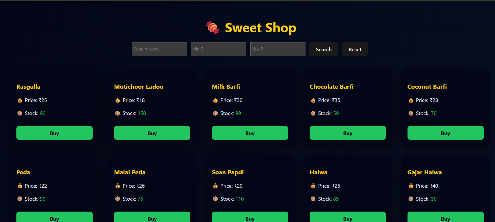
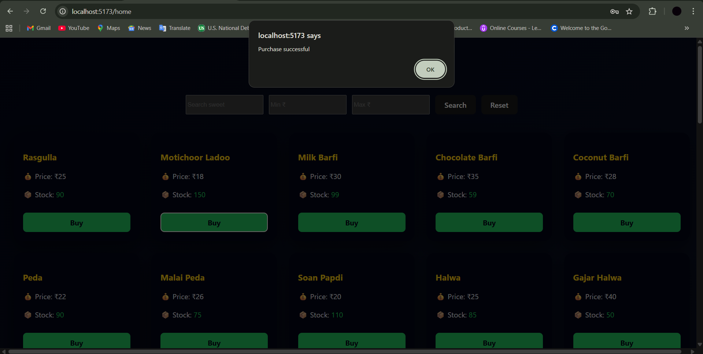
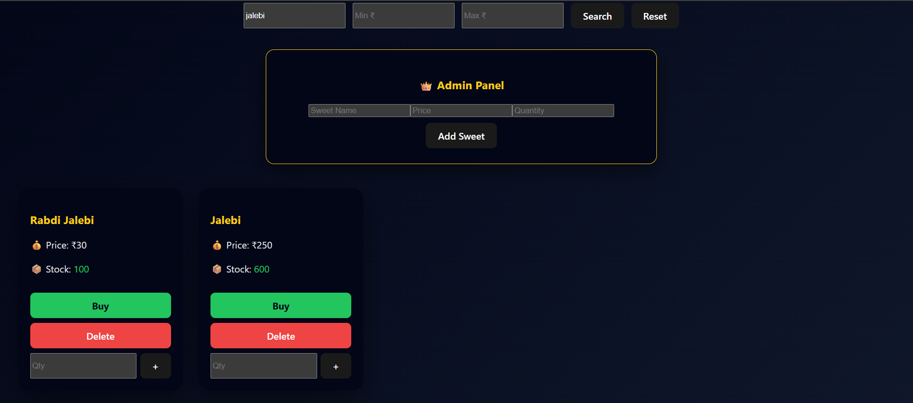

# 🍬 Sweet Shop Management System

A full-stack **Sweet Shop Management System** built using modern web technologies.  
This project demonstrates backend API development, frontend integration, authentication, inventory management, **Test-Driven Development (TDD)**, and responsible AI usage.

---

## 📌 Project Overview

The Sweet Shop Management System allows users to:
- Register and log in securely
- View available sweets
- Search sweets by name, category, and price range
- Purchase sweets (inventory reduces automatically)

**Admin users** can:
- Add new sweets
- Update sweet details
- Delete sweets
- Restock inventory

The project follows **Test-Driven Development (TDD)** and clean coding practices.

---

## 🛠️ Tech Stack

### Backend
- Node.js
- Express.js
- MongoDB
- Mongoose
- JWT Authentication
- Jest (Testing)

### Frontend
- React.js
- Vite
- Axios
- CSS / Tailwind / Bootstrap

### Tools
- Git & GitHub
- Postman
- AI Tools (see AI Usage section)

---

## 🔐 Authentication

- User Registration
- User Login
- JWT-based authentication
- Protected routes for sweets and inventory
- Role-based access (Admin & User)

---

## 📦 Backend API Endpoints

### Auth
| Method | Endpoint | Description |
|------|--------|------------|
| POST | `/api/auth/register` | Register new user |
| POST | `/api/auth/login` | Login user |

### Sweets
| Method | Endpoint | Description |
|------|--------|------------|
| POST | `/api/sweets` | Add new sweet (Admin) |
| GET | `/api/sweets` | Get all sweets |
| GET | `/api/sweets/search` | Search sweets |
| PUT | `/api/sweets/:id` | Update sweet |
| DELETE | `/api/sweets/:id` | Delete sweet (Admin) |

### Inventory
| Method | Endpoint | Description |
|------|--------|------------|
| POST | `/api/sweets/:id/purchase` | Purchase sweet |
| POST | `/api/sweets/:id/restock` | Restock sweet (Admin) |

---

## 🎨 Frontend Features

- User Registration & Login
- Sweet listing dashboard
- Search and filter sweets
- Purchase button (disabled if stock = 0)
- Admin panel for managing sweets
- Responsive card-based UI

---

## 🧪 Testing (TDD)

- Tests written before implementation
- Jest used for backend testing
- Covers:
  - Authentication
  - Sweet CRUD operations
  - Search functionality
  - Purchase & restock logic

### Run Tests
```bash
npm test
```

---

## 🚀 Setup Instructions

### 1️⃣ Clone Repository
```bash
git clone https://github.com/your-username/sweetshop.git
cd sweetshop
```

### 2️⃣ Backend Setup
```bash
cd backend
npm install
```

Create a `.env` file:
```env
PORT=5000
MONGO_URI=your_mongodb_connection_string
JWT_SECRET=your_secret_key
```

Run backend:
```bash
npm start
# or
npm run dev
```

Admin username: admin@sweet.com
pass:admin123

### 3️⃣ Frontend Setup
```bash
cd frontend
npm install
npm run dev
```

Frontend runs on:
```
http://localhost:5173
```

---

## 📸 Screenshots

### 🔐 Login Page


### 📝 Register Page


### 🏠 Dashboard


### 👑 Admin Panel


### ➕ Add Sweet (Admin)
.png)

### 🔍 Search (User)


### 🛒 Search & Purchase


---

## 🤖 My AI Usage

### AI Tools Used
- ChatGPT

### How I Used AI
- Generating boilerplate code for APIs
- Writing and improving Jest test cases
- Debugging errors
- Improving UI structure and layout
- Understanding best practices

### Reflection
AI significantly improved my productivity and understanding.  
I carefully reviewed and customized all AI-generated code to ensure correctness and originality.

---

## 📊 Test Report

- All test cases pass successfully
- High coverage for core backend logic
- Focused on real-world edge cases

---

## 👨‍💻 Author

**Mayur Kadam**  
Computer Engineering Graduate  
Aspiring Full Stack Developer

